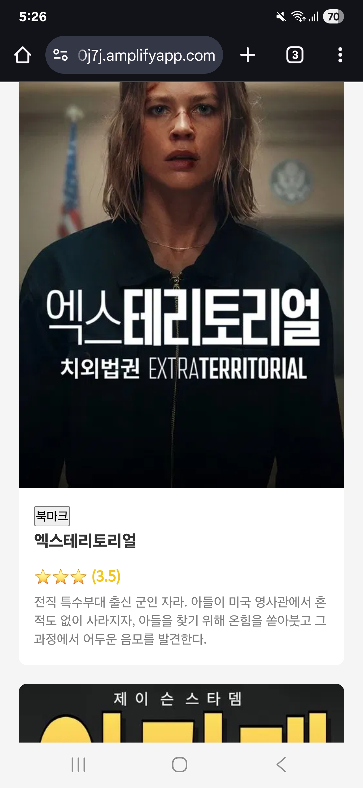
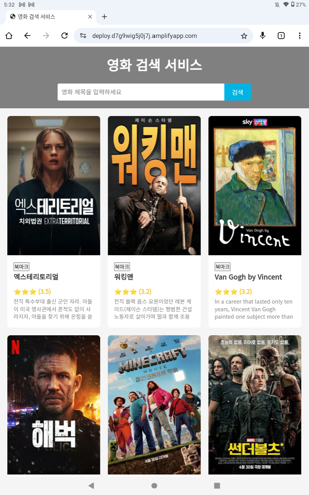
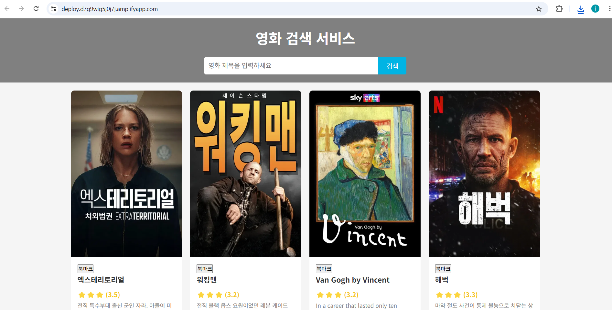

## 필수 기능 가이드

1. **TMDB API 연동**  
   `fetch`를 사용해 TMDB에서 제공한 API 예시로 인기 영화(popular)를 기본 화면에 표시합니다.  
   (예시 코드)
   ```js
   const response = await fetch('https://api.themoviedb.org/3/movie/popular?...');
   const data = await response.json();
   ```

2. **영화 카드 리스트 UI 구현**  
   1주차 스파르타코딩 실습코드의 영화카드 구조를 참고하여 직접 HTML/CSS로 구현했습니다.  
   부트스트랩 코드를 참고하되, 직접 스타일링하여 사용했습니다.

3. **영화 검색 기능**  
   검색창에 영화 제목을 입력하면 TMDB의 검색 API로 결과를 출력합니다.  
   ```js
   const response = await fetch('https://api.themoviedb.org/3/search/movie?...');
   ```

4. **영화 상세 모달 구현**  
   영화 카드를 클릭하면 상세 정보를 모달로 표시하며, 닫기는 'X' 버튼으로 구현했습니다.
   요약이 너무길면 카드가깨지는 문제가 생겨서 슬라이싱했습니다. 다른 속성들도 전처리 시켜서 가져왔습니다.  
   모달에는 포스터, 제목, 줄거리, 장르, 출연진, 개봉일 등 상세 정보가 포함됩니다.

---

## 도전 기능 가이드

- **Lv1. 모듈화 및 코드 분리**  
  기능별로 JS, CSS 파일을 분리하여 유지보수성을 높였습니다.  
  ```
  Movie
  ├── .gitignore
  ├── README.md
  ├── index.html
  ├── css
  │   ├── card.css
  │   ├── modal.css
  │   └── style.css
  └── js
      ├── api.js
      ├── app.js
      ├── env.js
      ├── modal.js
      └── ui.js
  ```

- **Lv1. 반응형 디자인**  
  CSS Grid와 미디어 쿼리를 활용해 PC, 태블릿, 모바일 모두에서 보기 좋은 레이아웃을 구현했습니다.  
  <p align="left">
    
    
    
  </p>

- **Lv1. 영화 검색 기능**  
  검색창에서 엔터 또는 버튼 클릭 시 실시간으로 영화 검색 결과를 표시합니다.  
  ```js
  movieUI.searchInput.addEventListener('keypress', async (e) => {
      if (e.key === 'Enter') {
          // 검색 실행
      }
  });
  ```

- **Lv2. 이벤트 위임**  
  영화 카드 클릭 이벤트를 상위 컨테이너에 위임하여 성능과 코드 효율을 개선했습니다.  
  ```js
  movieContainer.addEventListener('click', function(e) {
      // 이벤트 위임 처리
  });
  ```

- **Lv2. 로컬 저장소 활용한 '북마크' 기능**  
  북마크 버튼 클릭 시 localStorage에 영화 ID를 저장하여 관심 영화를 관리합니다.  
  ```js
  localStorage.setItem('bookmarks', JSON.stringify(bookmarks));
  ```

- **Lv2. async/await로 API 호출 리팩터링**  
  모든 비동기 API 호출을 async/await 문법으로 작성해 가독성과 유지보수성을 향상시켰습니다.  
  ```js
  document.addEventListener('DOMContentLoaded', async () => {
      modalUI.setModalEvents();
      const movies = await movieAPI.fetchMovies();
      movieUI.addMovies(movies);
  });
  ```

- **Lv2. 쓰로틀링/디바운싱**  
  검색, 엔터키 이벤트에만 API를 호출하여 불필요한 호출을 방지했습니다.

---

## 배포

- **deploy 브랜치**를 GitHub에 푸시하고, AWS Amplify를 통해 정적 웹사이트로 배포했습니다.  
- TMDB의 API Key는 Lambda + API Gateway(REST API)로 백엔드에서만 관리하여 보안을 강화했습니다.  
- API Gateway URL은 클라이언트에 노출되지만, CORS 설정으로 배포된 URL의 요청만 허가합니다.

---

### 배포 URL

[https://deploy.d7g9wig5j0j7j.amplifyapp.com/](https://deploy.d7g9wig5j0j7j.amplifyapp.com/)

여기서 직접 테스트해보세요!
